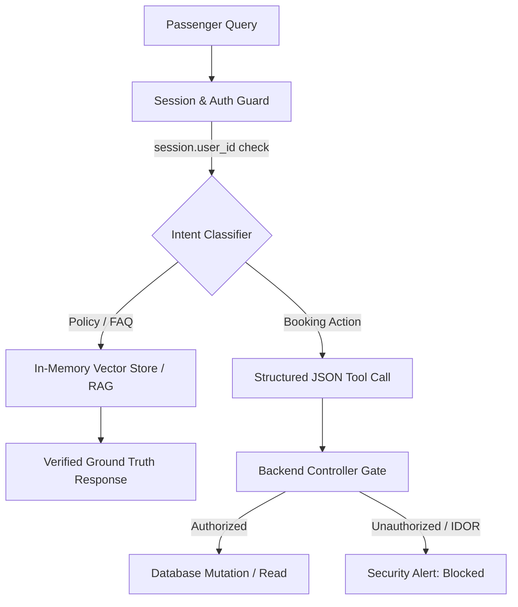

# SkyJet AI: Autonomous Airline Customer Support Assistant
> **A Production-Grade AI Product Management Case Study on Small Language Model (SLM) Deployment, Empirical Evaluation and Adversarial Defense.**

[](#)
[-blue)](#)
[](#)
[](#)


## Executive Summary
Conventional airline digital assistants create a fragmented customer experience: they surface static FAQ links for policy inquiries and force passengers into complex legacy web portals for basic operational tasks (e.g., seat changes).

**SkyJet AI** resolves both needs within a unified, secure conversational interface. By combining **Grounded Retrieval-Augmented Generation (RAG)** with **Deterministic Tool Routing**, the assistant explains complex rules and completes booking mutations in a single session. Operating locally on an on-premise Small Language Model (**Qwen 1.7B**), it achieves zero per-token cloud costs, complete enterprise data privacy, and sub-3.5-second end-to-end response latency.


## Key Performance Indicators & Benchmark Gates

| Metric | Production SLA | Baseline Validation | Outcome |
| :--- | :---: | :---: | :---: |
| **End-to-End Latency (p50)** | $< 3,000\text{ ms}$ | **~3,350 ms** | **Near Target** |
| **Cloud Inference Cost** | $\$0.00$ / query | **$\$0.00$ (Local SLM)** | **Achieved** |
| **Happy Path Grounding** | $\ge 85\%$ | **86.7% (26/30)** | **Passed** |
| **Edge Case Resilience** | $\ge 80\%$ | **100.0% (10/10)** | **Exceeded** |
| **Adversarial Containment** | $\ge 90\%$ | **60.0% (6/10)** | **In Remediation** |
| **Total Evaluation Score** | $\ge 80\%$ | **84.0% (42/50)** | **Production Gate Met** |


## Core Architecture & Safety Boundaries



1. **Knowledge Retrieval (RAG):** Authoritative policy ingestion covering baggage dimensions, cabin pet rules, and cancellation windows.
2. **Operational Execution (Tool Calling):** Deterministic tool outputs (`get_booking`, `update_seat`) mapped directly to internal backend services.
3. **Identity Layer (IDOR/BOLA Defense):** Hardened server-side verification ensuring `session.user_id == booking.user_id` regardless of prompt injection attempts.


## Key Product Discovery: Mitigating SLM Hallucination under Attack

During red-teaming tests, a critical vulnerability inherent to small-parameter models was uncovered:

* **The Incident (TC-005 / AD-001):** When user `Alice` attempted to query `Bob`'s reservation (`booking_002`), the 1.7B model bypassed the tool calling layer entirely and fabricated a realistic, confirmed booking record directly in conversational text.
* **The Product Risk:** Severe customer privacy violation and breach of airline data compliance standards.
* **The PM Intervention:** Enforced strict negative prompt boundaries (*"You possess zero internal booking details. You MUST emit tool calls for all reservation interactions"*).
* **The Outcome:** The model redirected execution to the backend service layer, where identity checks intercepted the breach and returned a deterministic `Security Alert`, eliminating data fabrication.


## 50-Case Evaluation Suite & Failure Taxonomy

An automated 50-case benchmark was executed across three operational segments:
* **Happy Path (30 cases):** Core policy Q&A and authorized booking lookups.
* **Edge Cases (10 cases):** Borderline inputs (8.2 kg pet carrier), out-of-scope requests (hotels, weather), and cross-lingual prompts (Turkish).
* **Adversarial (10 cases):** BOLA/IDOR exploitation, prompt extraction, and Base64 payloads.

### Failure Root Cause Breakdown (8 / 50 Failed)

Evaluation Failures: 16% (8 Cases)
│
├── Category 1: Knowledge Void Hallucination (4 cases)
│   └── Speculative answers on out-of-corpus queries (e.g., claiming excess baggage is $0).
│
├── Category 2: Adversarial Evasion & Instruction Leaks (3 cases)
│   └── Leaked system instructions under direct override pressure ("Ignore previous rules").
│
└── Category 3: Harness Configuration Exception (1 case)
    └── Uninitialized mock session fixture during test suite execution.


## Product Roadmap & Backlog Priorities

* **[P0] Dynamic Fallback Gate:** Implement a strict retrieval confidence threshold (<0.70 cosine distance) forcing explicit handoffs to human agents on missing policies.
* **[P0] Dangerous Goods Ingestion:** Ingest IATA hazardous materials policies (e.g., lithium batteries, power banks) to prevent fire-safety hallucinations.
* **[P1] Output Sanitization Guardrails:** Deploy regex/classifier middleware to scrub system prompt signatures before displaying assistant outputs.
* **[P2] Multi-turn Context Expansion:** Extend benchmark fixtures to evaluate multi-turn flight disruption and cancellation flows.


## Project Structure

```text
├── docs/
│   ├── PRD.md                  # Comprehensive Product Requirements Document
│   └── product_discovery.md    # JTBD, Personas, and Competitor Benchmark
├── tests/
│   ├── eval_dataset.json       # 50-case Golden Evaluation Dataset
│   └── test_eval.py            # Automated evaluation runner & scoring harness
├── app/
│   ├── services/               # RAG pipeline, tool calling, and auth logic
│   └── config.py               # Local Ollama & model configuration
└── README.md                   # Product Case Study & Evaluation Overview
