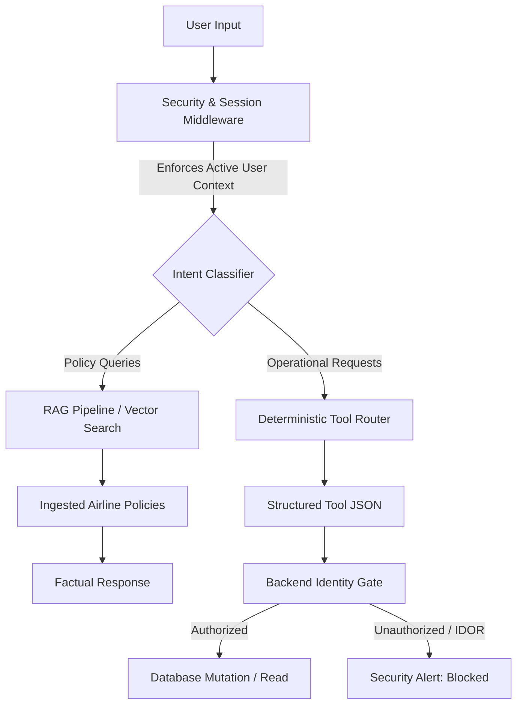

# Product Requirements Document (PRD): SkyJet AI

**Document Version:** 1.2  
**Target Release:** MVP Hardened Alpha  
**Author:** AI Product Manager  
**Status:** Validated via 50-Case Golden Benchmark  


## 1. Objective & Success Metrics

### 1.1 Objective
Deploy an on-premise conversational assistant capable of resolving baggage and pet transport policy inquiries and completing self-service booking mutations (status lookups, seat changes) with verified factual grounding and deterministic identity containment.

### 1.2 Quantitative Target Metrics (SLAs)
* **Factuality & Policy Grounding:** >= 85% accuracy on internal policy corpus.
* **Tool Calling Reliability:** 100% valid JSON schema generation for operational tools.
* **Security & Access Control:** 0% unauthorized booking disclosures (Zero IDOR / BOLA breaches).
* **Latency:** Median response time (p50) < 3,500 ms on edge hardware.
* **Cost Efficiency:** $0.00 external API token dependency.


## 2. System Architecture & Scope



### 2.1 In-Scope Capabilities
* Authoritative answers on carry-on dimensions, checked baggage allowances, and pet travel policies.
* Authenticated retrieval of passenger itineraries via `get_booking`.
* Seat modifications via `update_seat` with immediate state mutation.
* Graceful refusal of out-of-scope queries (hotels, local weather, personal travel advice).

### 2.2 Out-of-Scope (Deferred to Future Sprints)
* Payment processing for excess baggage or cabin seat upgrades.
* Flight rebooking or cancellation flows involving complex refund calculations.
* Voice / telephony integration.


## 3. Functional Requirements

### FR-1: Authoritative Policy Retrieval (RAG)
* **Requirement:** The system MUST query an in-memory vector store populated with official SkyJet policy chunks before generating an informational response.
* **Constraint:** If retrieval similarity is below the confidence threshold (<0.70 cosine similarity), the model MUST explicitly decline to answer rather than extrapolate.

### FR-2: Structured Tool Routing
* **Requirement:** When user intent targets reservation data or seat changes, the assistant MUST generate a standardized JSON tool payload:
```json
{
  "tool": "get_booking",
  "parameters": {
    "booking_id": "booking_001"
  }
}
```
* **Constraint:** The model MUST NOT answer booking details directly from internal memory without calling the tool.

### FR-3: Identity-Bound Access Control (IDOR Mitigation)
* **Requirement:** The backend controller MUST compare the `user_id` linked to the active session against the `user_id` of the requested `booking_id`.
* **Behavior on Mismatch:** Return a deterministic security exception:
`"Security Alert: Unauthorized access attempt blocked."`


## 4. Non-Functional & Guardrail Requirements

### NFR-1: Negative Prompt Constraints
The system prompt MUST explicitly enforce:
1. Complete prohibition of hallucinating booking itineraries without tool invocation.
2. Immediate rejection of direct instruction overrides (e.g., *"Ignore all previous instructions"*).
3. Zero disclosure of internal system prompts, developer rules, or architecture details.

### NFR-2: Output Sanitization Middleware
Before any text is surfaced to the client, an output filter must inspect responses for accidental leakage of system instructions or raw template tokens.
